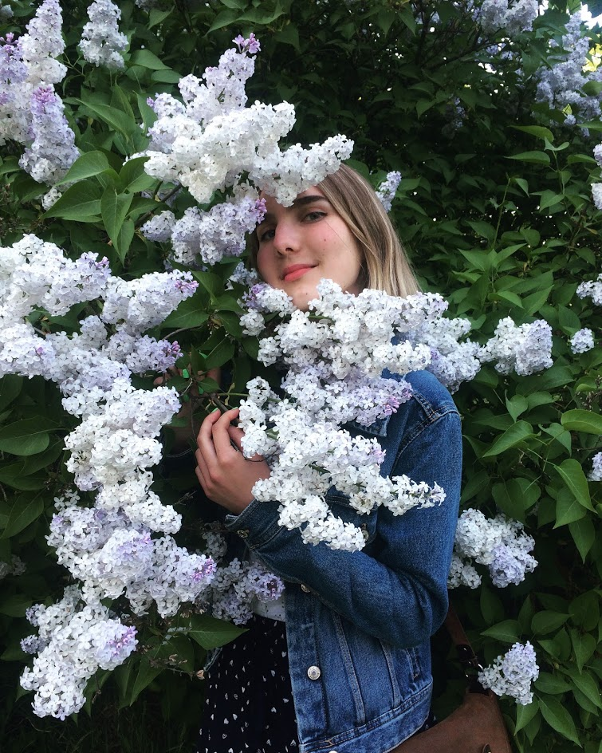

<html lang="en-US">
	  <body>
	<section class="page-header" align = "center">
      <h1 class="project-name" align = "center"><strong>Lizaveta Novik</strong></h1>
       
 <a href="https://github.com/lizanovik/lizanovik.github.io" class="btn">View on GitHub</a>

		

		</section>
 <section class="main-content">
<table width="100%" cellspacing="0" cellpadding="5">
	<caption> <h1 id="about-me">About me</h1> </caption>
   <tr> 
    <td width="300" valign = "top">

 I am a 3-year student of BSUIR, studying at the Faculty of Information Technologies and Control.
My specialty is Automated Information Processing Systems. 
There I try to work hard and achieve my goals. 
But the university is not a limit. 
To be successful, you need work on yourself efficiently. 
So, I’m here, doing self-education and trying to break into an adult world.
 After all, dedication is a way to success! 

</td>
    <td valign="top">
	<h3><strong> Hard skills: </strong></h3>
	<ul>
		<li>Knowledge of OOP</li>
		<li>Good understanding of databases and SQL</li>
		<li>C#, basic of .Net</li>
		<li>C++</li>
		<li>Basic of HTML, CSS</li>
		<li>Basic knowledge of Java and Android Studio development</li>
		<li>English on the Upper Intermediate level</li>
	</ul>
	<h3><strong> Soft skills: </strong></h3>
		
It’s quite hard to describe yourself objectively, but I'll try. 
		I think that my main strength is my responsibility. 
		Also I am a good listener, calm, sensible, self-motivated and uninhibited, diligent, attentive to details, a quick and eager learner. 
		I have mathematical thinking, but I am literate and creative at the same time.

</td>
   </tr>
</table>
	<h2><strong>Interests</strong></h2>

My personal interests include:

	<ul>
		<li>Painting. I adore watercolor painting, but now I haven’t got enough time to it.
		 But in summer I like drawing in nature. I find it gorgeous to paint native landscapes.</li>
		<li>Reading a lot. I prefer fiction, but I’m also interested in non-fiction, educational and developing literature.</li>
		<li>Active participation in university life. I suppose that It is very important to spend your time at university as brightly as possible, 
		because it is an integral step between your childhood and adult life.</li>
	</ul>
	<h2><strong>My achievements: </strong></h2>
	 <h3><strong>Online stage: </strong></h3>
	 <ul>
		<li> <a href="https://www.codewars.com/users/liza_novik" class="btn">My Codewars Profile</a></li>
		<li><a href="https://github.com/lizanovik?tab=repositories" class="btn">My Github Repositories</a></li>
		 <li><a href="https://github.com/lizanovik/Top20FibonacciSequence" class="btn">Basic Collections</a></li>
		 <li><a href="https://github.com/lizanovik/TicTacToe" class="btn">TicTacToe</a></li>
		 <li><a href="https://github.com/lizanovik/HexToRgb" class="btn">HexToRgb Codewars Kata</a></li>
	</ul>
	 
<strong>PadawansTask: </strong>

	 <ul>
		<li> <a href="https://github.com/lizanovik/PadawansTasks" class="btn">Padawans Tasks</a></li>
	</ul>
	 <h3><strong>Offline stage: </strong></h3>
	 <ul>
		 <li> <a href="https://github.com/lizanovik/NET1.S.2019.Novik" class="btn">Days</a></li>
	 </ul>
</section>
</body>
</html>
